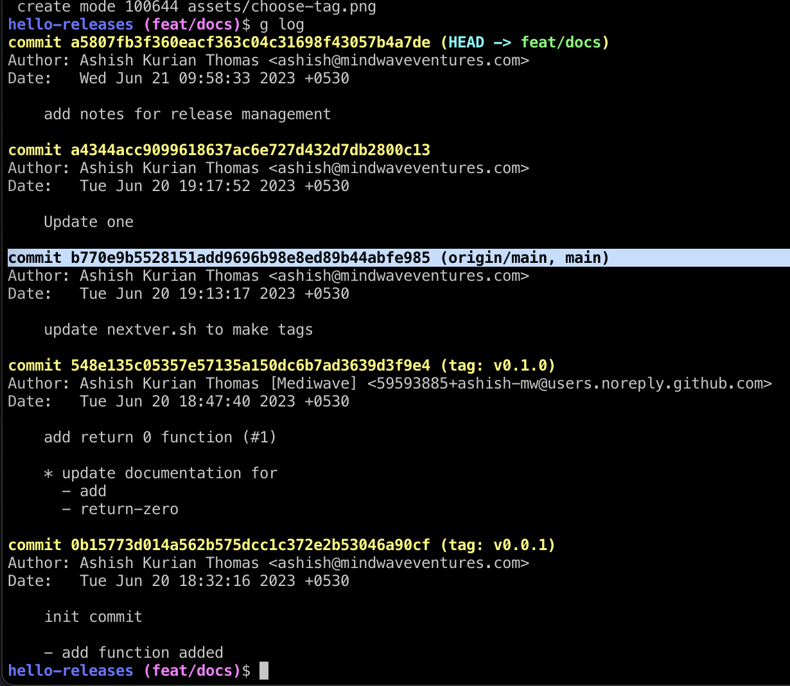
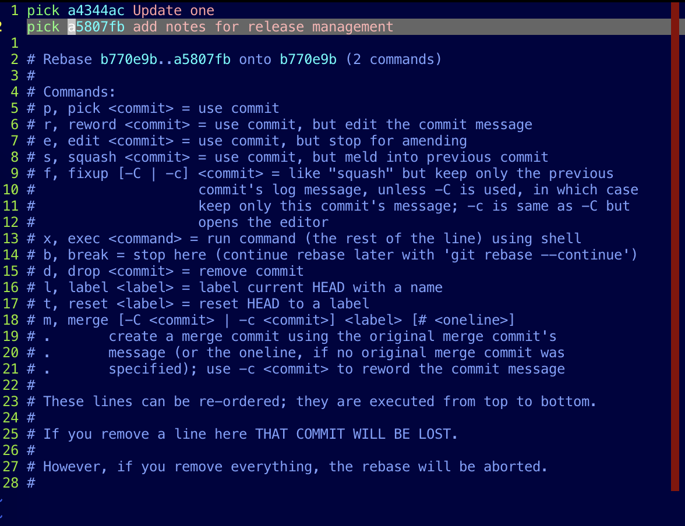
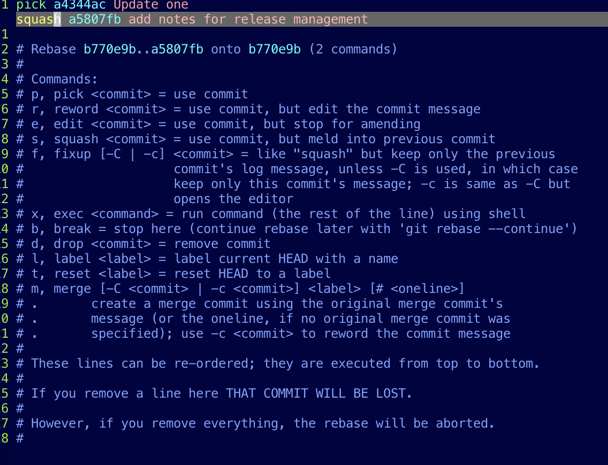
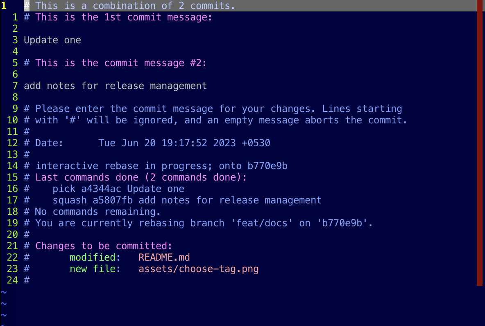
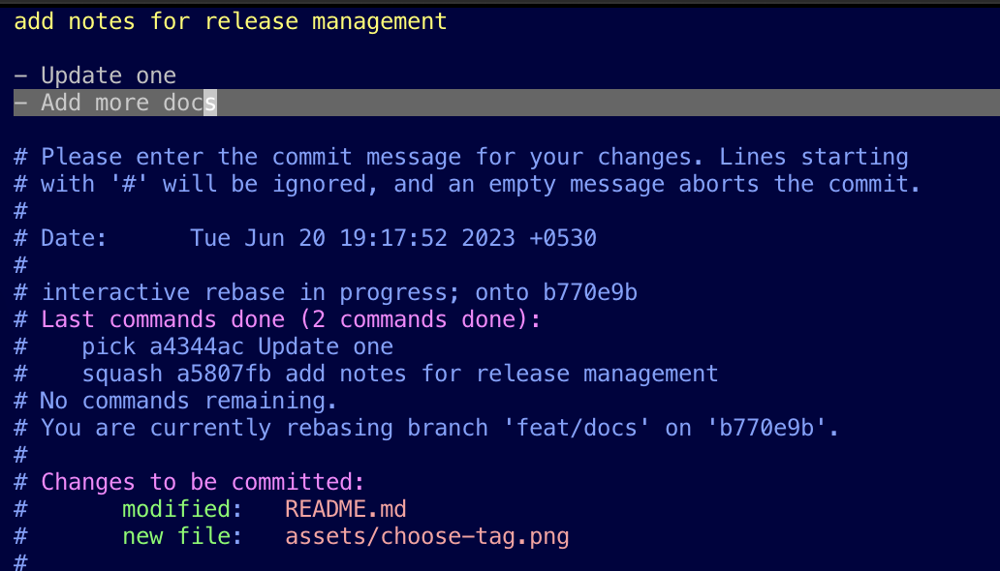
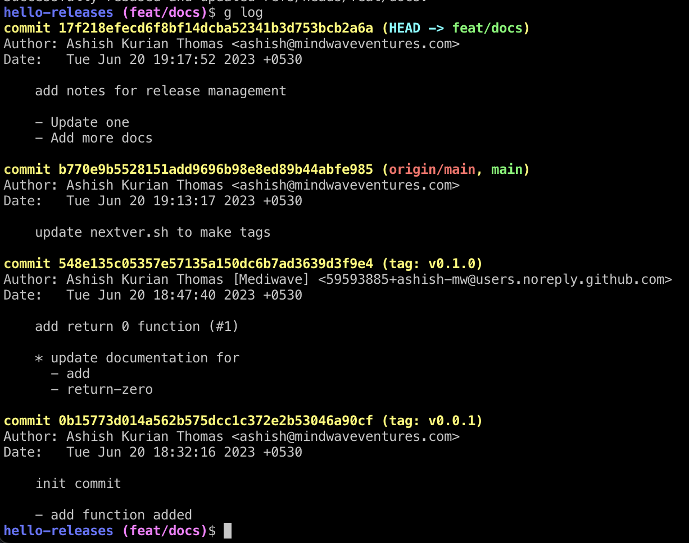
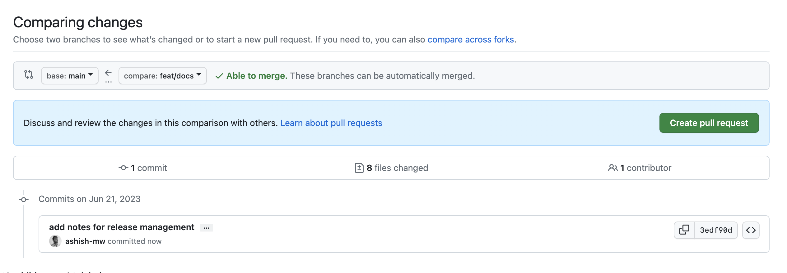
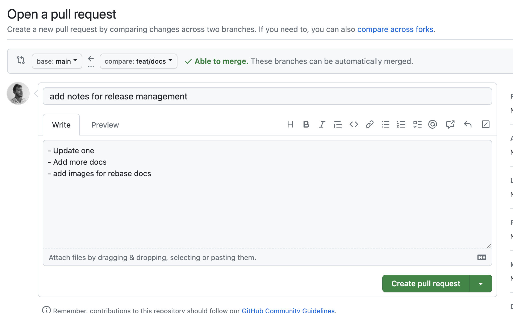
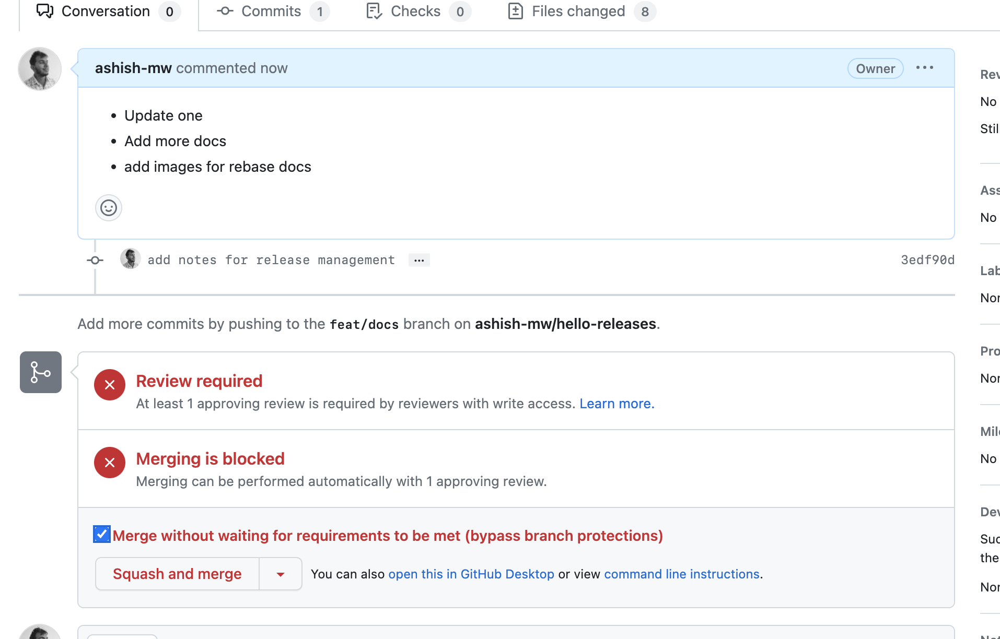
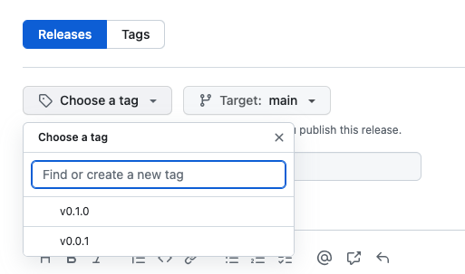

# Learning release management

This is a hypothetical library project to learn release management.

## Steps

1. Create a feature branch from the base branch

    ```
    $ git checkout -b feat/docs
    ```

2. Make your changes and commit often

    ```
    $ git commit -am 'Update one'
    $ git commit -am 'Update two'
    ```

3. Then `rebase` to make a clean-single commit that you can raise a PR with

    ```
    $ git rebase -i <commit-id>
    ```

    `<commit-id>` is the last commit that you want to keep.

    In our example,

    - Choosing the commit to keep
        
    - What does `git rebase -i b770e9b5528151add9696b98e8ed89b44abfe985` look like?
        

4. Your text editor will open up with the list of commits. `squash` every commit
except for the first.

    
    

    The commit message needs to be edited for readability.
    

    Our new log
    

5. Now raise a PR on github. You'll only see one commit.
While merging choose "Squash and merge". This will not create a merge commit.

    

    Voila! a beautiful single commit PR
    

    **Squash and merge 🚀**
    

6. Delete your branch
    ```
    $ git branch -D feat/docs
    $ git push origin --delete feat/docs
    ```

7. Check out to your base branch, usually `main` and pull in
your PR updates
    ```
    $ git checkout main
    $ git pull origin main
    ```

8. Run the `nextver.sh` script
    ```
    $ ./nextver.sh
    ```

    The above will do a patch release i.e `x.x.<patch>`.
    To do a minor relase, do
    ```
    $ ./nextver.sh minor
    ```
    To do a major release, do
    ```
    $ ./nextver.sh minor
    ```


9. The above will create a git [tag](https://git-scm.com/book/en/v2/Git-Basics-Tagging)
    ```
    $ git log
    commit 0b15773d014a562b575dcc1c372e2b53046a90cf (tag: v0.0.1)
    Author: Ashish Kurian Thomas <ashish@mindwaveventures.com>
    Date:   Tue Jun 20 18:32:16 2023 +0530

        init commit

        - add function added
    ```

    Check the tag with

    ```
    $ git tag -l
    ```

    To delete a tag, do
    ```
    $ git tag -d <tag_name>
    ```

10. Push the tag up to github

    ```
    $ git push origin v0.0.1
    ```
11. Go to [github releases](https://github.com/ashish-mw/hello-releases/releases/new) for your repo and create a new release.

12. Choose the `tag` that you made.

    

13. Click on "Generate release notes" button. This will pull
in the commits that we merged from the PRs up untill this
point

14. Click on publish release

## TODO

- [ ] Could we use a [github action](https://github.com/elgohr/Github-Release-Action) to do automatic releases?

## Dummy project's documentation
### add

returns sum of elements passed to it

example:

```js
const { add } = require('./lib/add')
console.log('Add: ', add(1,2,3,4))
```

### return-zero

returns 0.

example:

```js
const { zero } = require('./lib/return-zero')
console.log('Zero: ', zero())
```